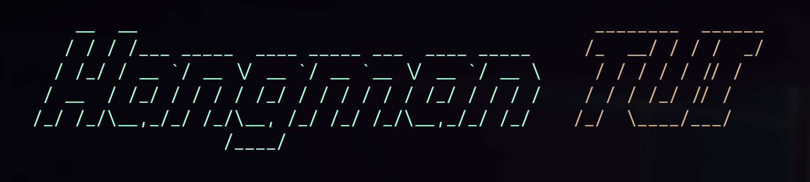

<h1>
    <p align="center">
    <br>Hangman TUI
</h1>
<p align="center">
    A minimal Hangman game for the terminal.
    <br />
</p>

## About

**Hangman** is a terminal-based word-guessing game designed for quick
mental breaks.

You can play it right from your terminal while working, giving your brain
a few moments to relax without leaving your workflow.

The game is simple: guess letters to reveal a hidden word, but beware -
too many wrong guesses and you lose!

Perfect for developers, students, and anyone who lives in the terminal
and needs a small, fun distraction.

## How to play?

### 1. **Play with default words**

To play the game with the default word list, simply execute the binary:
```bash
./hangman-tui
```
The will start from the home menu.
You will be given the opportunity to select the length of the word and number of attempts.
The word must be guessed before you run out of attempts, otherwise you lose.

### 2. **Play with custom words**

If you want to use your own list of words, you can pass
a -words flag followed by the **path** to your custom word list file.
The word list should contain one word per line.

For example:

```bash
./hangman-tui -words=/path/to/your/custom-words.txt
```

### Custom Word List Format
- Your custom word list should be a **plain text file**.
- Each word should be on its own line.
- Any leading or trailing spaces will be removed.
- The game will ignore lines that contain non-letter characters.

Example of a custom word list file:

```bash
strawberry
banana
apple
watermelon
```
> **Note:** If the custom word list is not found, the game will exit with a message telling you about the problem.

### Requirements
- ANSI terminal.
- A compiled binary of the Hangman TUI game.


